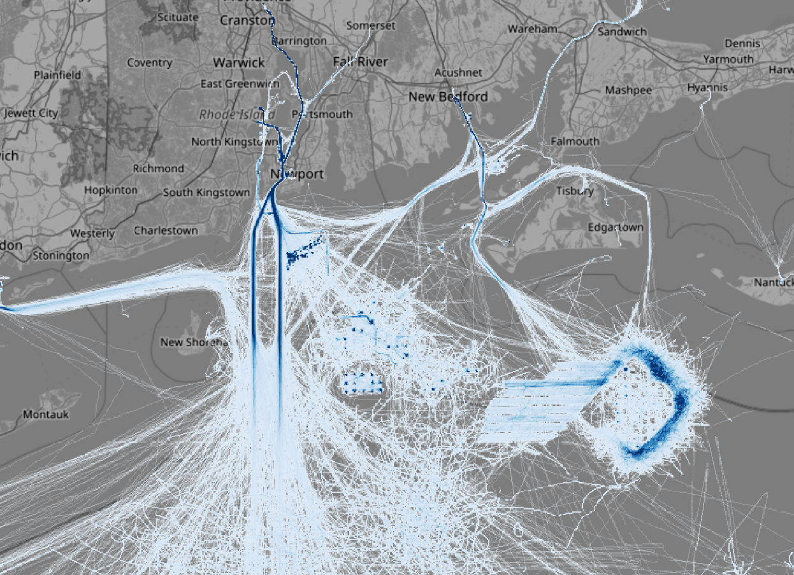
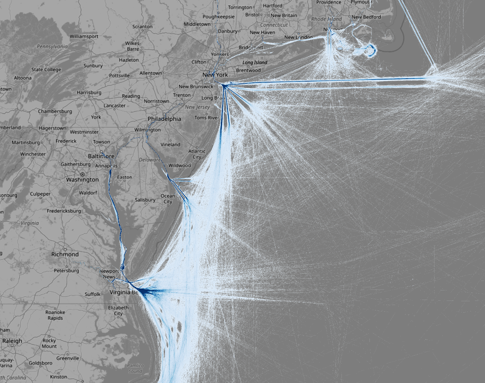
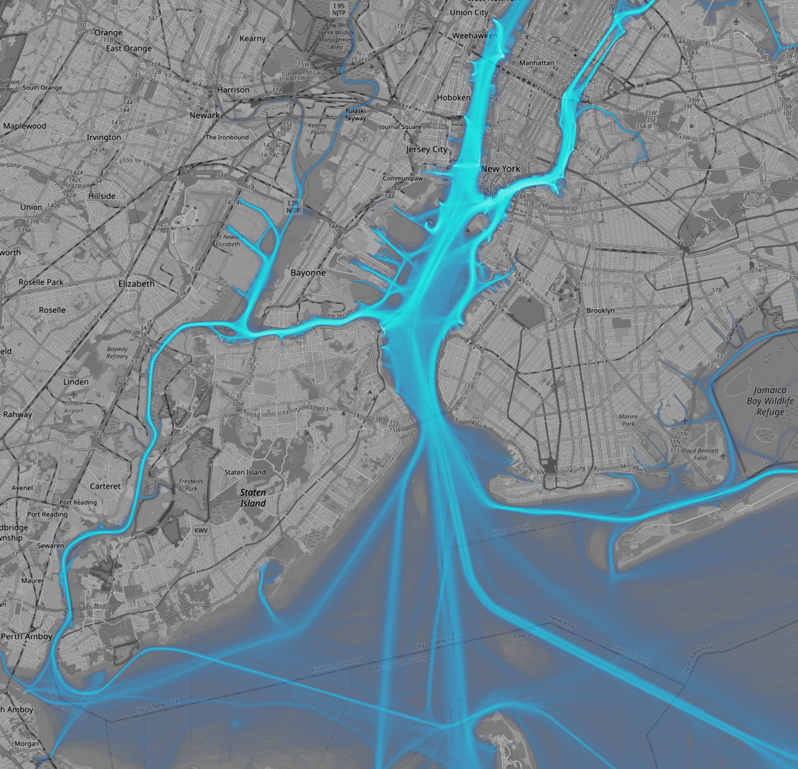
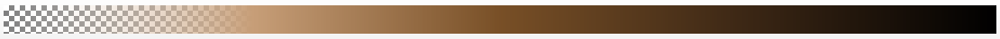

# Architecture & Design

## Overview
The AIS Visualization pipeline is designed to process massive datasets (10GB+) of vessel tracks and render them into high-resolution, tiled maps. It prioritizes scalability, memory efficiency, and visual quality.

## Technology Stack
- **Dask**: For parallel, out-of-core processing. It handles data loading, partitioning, and distributed computation.
- **Datashader**: For high-performance rasterization of vector data. It aggregates millions of points/lines into grids without overplotting issues.
- **Xarray & Zarr**: For efficient storage of multi-dimensional raster data. Zarr provides chunked, compressed storage ideal for cloud and parallel access.
- **Click**: For a robust, composable Command Line Interface (CLI).
- **GeoPandas & PyArrow**: For efficient spatial data handling and I/O.

## Architectural Considerations

### 1. Spatial Partitioning
Raw AIS data is often unsorted. To enable efficient rendering, we first preprocess the data into spatially partitioned GeoParquet files. This allows Dask to load only the relevant data chunks for each tile, significantly reducing memory usage and I/O.

### 2. The "Global Max" Problem
To create a seamless map where colors mean the same thing across all tiles, we must normalize pixel values against a **global maximum** density.
- **Phase 1 (Rendering)**: Each tile is rendered independently to a Zarr array (raw counts).
- **Phase 2 (Post-processing)**: We compute the global maximum across *all* tiles.
- **Phase 3 (Visualization)**: We re-process the tiles, applying the colormap normalized by this global max.

### 3. Memory Management
Processing high-zoom levels (e.g., Zoom 10) involves thousands of tiles.
- **Batching**: We process tiles in batches (e.g., 20) to control memory pressure.
- **Resource Monitoring**: A background thread monitors RAM usage and pauses submission if thresholds are exceeded.
- **Explicit GC**: We force garbage collection after batches to prevent memory leaks in long-running processes.

### 4. Migration to Zarr (from NetCDF)
We migrated the intermediate storage format from NetCDF to Zarr to address concurrency issues.
- **Problem**: NetCDF (based on HDF5) often requires file locking, which causes failures or corruption when multiple Dask workers attempt to write to the same dataset or even different files in the same directory concurrently.
- **Solution**: Zarr is designed for cloud-native, parallel access. It uses a directory of chunks, allowing multiple workers to write to independent keys without locking conflicts.
- **Note**: While Zarr enables safe parallel writing, we still recommend limiting concurrency for the *pyramid generation* step (`post_process.py`) to avoid excessive memory usage:
  ```bash
  # Run with a single worker for maximum stability
  uv run dask worker tcp://127.0.0.1:8786 --nworkers 1 --memory-limit 8GB
  ```

### 5. Performance Benchmarks
Estimates based on a full run of the US dataset, accounting for **data sparsity**.
- **Sparsity Factor**: At Zoom 10, we observe ~20% tile occupancy. As zoom increases, occupancy drops by ~50% per level (linear features), significantly reducing storage and compute time compared to dense estimates.
- **Avg. Size per Tile**: ~370 KB (Occupied tiles only)
- **M2 Rate**: Variable (slower for dense levels, faster for sparse levels due to empty tile skipping)
- **HPC / Cloud Rate**: ~100x M2 (assuming 100 nodes)

| Zoom | Tiles (Total) | Resolution | Occupancy (Est.) | Probable Size | Est. Time (M2) | Est. Time (HPC / Cloud) |
|---|---|---|---|---|---|---|
| 5 | 66 | 4.9 km | 100% | ~24 MB | < 1 min | < 1 sec |
| 6 | 210 | 2.4 km | 90% | ~70 MB | < 1 min | < 1 sec |
| 7 | 779 | 1.2 km | 80% | ~230 MB | ~5 mins | < 5 secs |
| 8 | 2,952 | 611 m | 60% | ~650 MB | ~15 mins | ~10 secs |
| 9 | 11,573 | 305 m | 40% | ~1.7 GB | ~1 hour | ~35 secs |
| 10 | 45,825 | 152 m | 21% (Observed) | ~3.5 GB | ~4.5 hours | ~3 mins |
| 11 | 182,369 | 76 m | ~10% | ~7 GB | ~15 hours | ~9 mins |
| 12 | 728,178 | 38 m | ~5% | ~14 GB | ~2 days | ~30 mins |
| 13 | 2,908,995 | 19 m | ~2.5% | ~28 GB | ~3.3 days | ~50 mins |
| 14 | 11,628,549 | 9.5 m | ~1.3% | ~56 GB | ~10 days | ~2.5 hours |

> **Note**: "Probable Size" accounts for empty tiles being skipped. "Dense Size" (worst case) would be significantly higher (e.g., ~4.3 TB for Z14).

## Known Issues & Limitations
- **Zarr Serialization**: We explicitly disable compression for the `spatial_ref` coordinate to avoid `numpy.int64` serialization warnings in some versions of Xarray/Zarr.
- **GPKG Performance**: Reading from GeoPackage is significantly slower than Parquet. Always preprocess to Parquet first.
- **Edge Artifacts**: Without the global max normalization, tiles would have individual color scales, creating visible "checkerboard" artifacts at tile boundaries.

## Visuals

### Map Details
High-resolution renderings showing vessel track density.





### Colormaps
Custom transparent colormaps used for visualization.

| Crameri Oslo (L=20%) | Brown / Gold |
|---|---|
|  |  |

## Future Improvements
- **Dynamic Tiling**: Serve tiles dynamically from the raw data using a tile server (e.g., TiPpecanoe or a custom Python server) instead of pre-rendering everything.
- **Vector Tiles**: For lower zoom levels, vector tiles (MVT) might offer better interactivity than raster PNGs.
